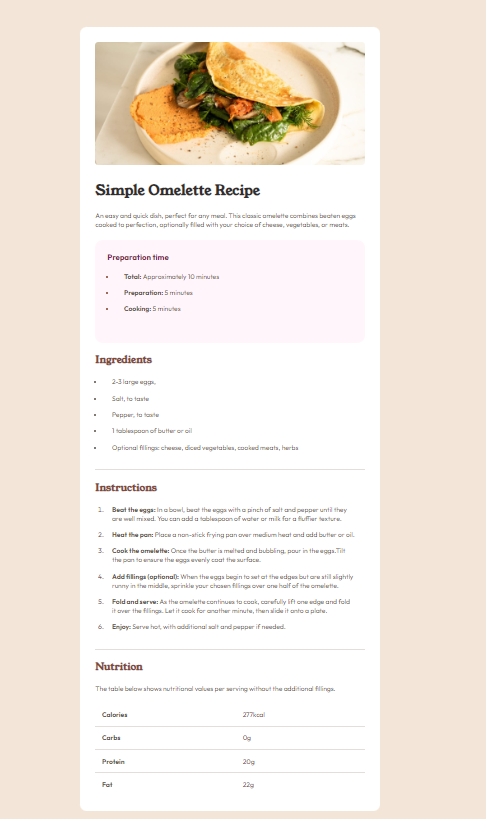
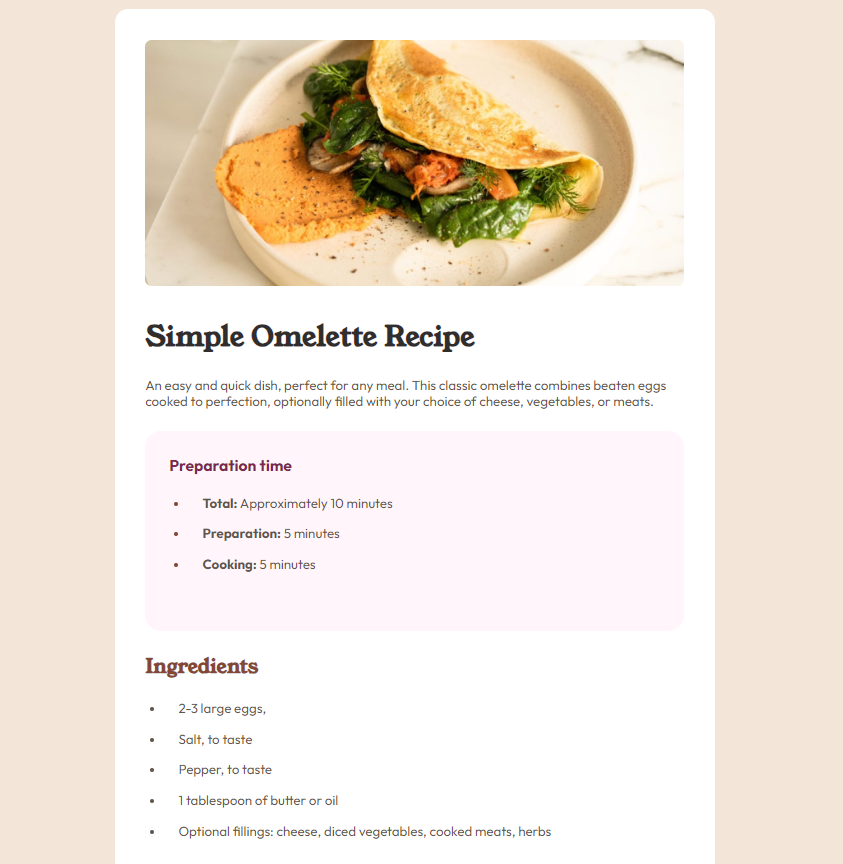
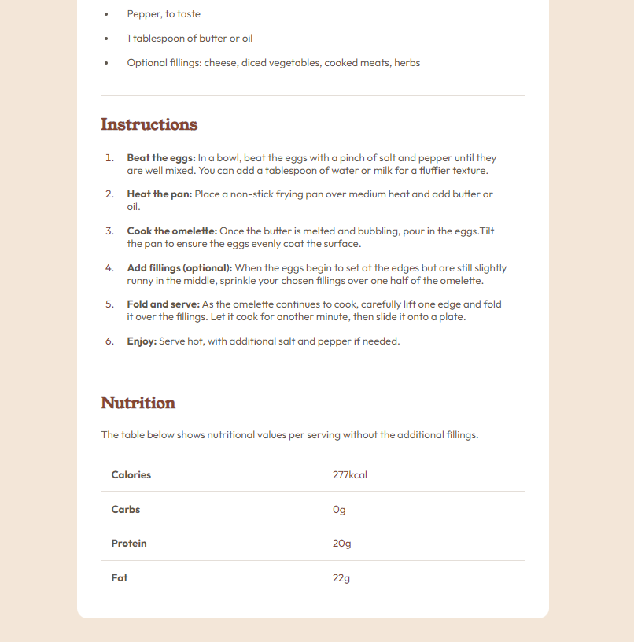

# Frontend Mentor - Recipe page solution

This is a solution to the [Recipe page challenge on Frontend Mentor](https://www.frontendmentor.io/challenges/recipe-page-KiTsR8QQKm). Frontend Mentor challenges help you improve your coding skills by building realistic projects.

## Table of contents

- [Overview](#overview)
  - [The challenge](#the-challenge)
  - [Screenshot](#screenshot)
  - [Links](#links)
- [My process](#my-process)
  - [Built with](#built-with)

## Overview

### Screenshot

### Links

- Solution URL: [Add solution URL here](https://your-solution-url.com)
- Live Site URL: [Add live site URL here](https://your-live-site-url.com)

## My process

### Built with

- **HTML5** - For creating the structure of the page and semantic elements.
- **CSS3** - For styling, layout, and responsive design using Flexbox, Grid, and Media Queries.
- **BEM Methodology** - For organizing CSS with block, element, and modifier classes to keep styles modular and reusable.
- **Google Fonts** - [Young Serif](https://fonts.google.com/specimen/Young+Serif) and [Outfit](https://fonts.google.com/specimen/Outfit) for beautiful typography.
- **Frontend Mentor** - [Challenge](https://www.frontendmentor.io) used as a project inspiration and guideline.
